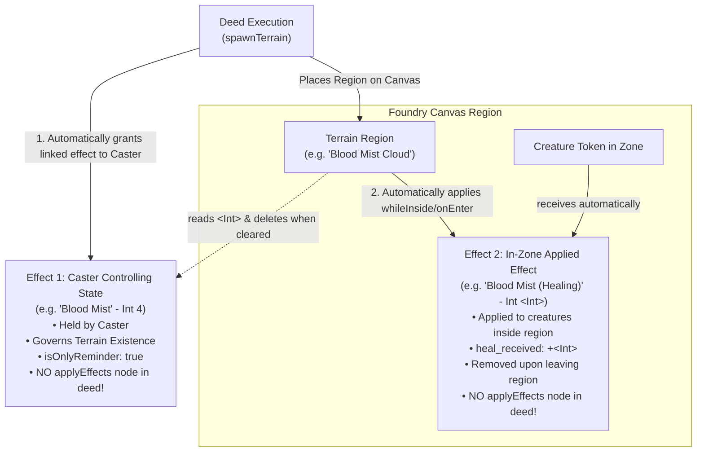

# Trespasser TTRPG: LLM Deed & Content Creation Guide

This guide details how to configure and use a local or cloud LLM (via the **Trespasser MCP Server**) to author **Deeds**, **Effects**, and **Terrains** for the Trespasser Foundry V14 system.

---

## 1. Connecting the MCP Server

The Trespasser MCP server communicates via standard JSON-RPC 2.0 over `stdio`. It has **zero external dependencies** and runs directly via Node.js.

### Claude Desktop Configuration
Add the server to your `claude_desktop_config.json`:
- **Windows**: `%APPDATA%\Claude\claude_desktop_config.json`
- **macOS**: `~/Library/Application Support/Claude/claude_desktop_config.json`

```json
{
  "mcpServers": {
    "trespasser": {
      "command": "node",
      "args": [
        "c:/Users/Rodrigo/AppData/Local/FoundryVTT/Data/systems/trespasser/scripts/mcp/server.mjs"
      ]
    }
  }
}
```

### Cursor / Continue / Antigravity Configuration
In your MCP client settings file:

```json
{
  "mcpServers": {
    "trespasser": {
      "command": "node",
      "args": [
        "c:/Users/Rodrigo/AppData/Local/FoundryVTT/Data/systems/trespasser/scripts/mcp/server.mjs"
      ]
    }
  }
}
```

---

## 2. LLM System Prompt Template

When interacting with an LLM to design Trespasser content, provide this concise system prompt:

```text
You are an expert game designer and content creator for the Trespasser TTRPG system in Foundry VTT.
You have access to the Trespasser MCP tools:
- `search_compendium`: Query existing effects, terrains, deeds, and equipment.
- `get_item_details`: Inspect the full data schema of any compendium item.
- `create_effect`: Create new Effect items (status conditions, buffs, debuffs).
- `create_terrain`: Create new Terrain items (zones, obstacles, clouds, hazard areas).
- `create_deed`: Build complete Behavior-Driven Deeds with automated graph topology and visual layout.
- `validate_deed_graph`: Audit deed behavior graphs against system rules.

Always follow this creation order:
1. Search the compendium first with `search_compendium` to reuse existing canonical effects (e.g., Burning, Bleeding, Dazed, Guarded, Hindered, Prone) rather than creating duplicates.
2. If a custom condition or buff is required, call `create_effect`. Note the returned UUID.
3. If the deed spawns a terrain (hazard, zone, or cloud), follow the TWO-EFFECT PATTERN:
   a. Caster Sustaining State: Create an effect representing the caster maintaining control (e.g., 'Blood Mist', Intensity 4, isOnlyReminder: true). Its UUID goes in terrain's `linkedEffects`.
   b. In-Zone Applied Effect: Create a SEPARATE effect for creatures entering or standing inside (e.g., 'Blood Mist (Healing)', modifier '+<Int>'). Its UUID goes in terrain's `behaviors.effects`.
   c. NEVER reuse the same effect for both!
   d. NEVER add redundant `applyEffects` nodes in the deed: `spawnTerrain` automatically grants the linked effect to the caster, and the terrain region automatically applies the in-zone effect to tokens inside. Adding `applyEffects` will double-apply the buff/debuff.
4. Call `create_deed` with the complete declarative specification.
5. Review the automated validation results from `create_deed`. If any warnings or errors are raised, fix them immediately.
```

---

## 3. Core Mechanics & Design Rules

### Deed Tiers & Action Economy
- **Light**: At-will basic deeds and cantrips. No focus cost (or 1 Focus).
- **Heavy**: Resourceful or situational abilities. Moderate focus cost (2–3 Focus).
- **Mighty**: High-impact signature moves and powerful spells (4+ Focus).
- **Special**: Reaction deeds, stances, or passive/triggered features.

### Action Types & Accuracy
- **`attack`**: Standard offensive deed. Requires target defense test (`versus: "Guard"`, `"Resist"`, or `"10"`). Branches on `onHit`, `onSpark`, and `onMiss`.
- **`support`**: Buffs, heals, and utility deeds. Does not require an accuracy test.

### Ability Types & Range Requirements
- **`innate`**: No weapon required. Can always be attempted.
- **`melee`**: Requires melee weapon or free hand. Range: 1 square (or 2 for polearms).
- **`missile`**: Requires missile weapon in hand (bow, crossbow, sling). Range governed by weapon.
- **`spell`**: Requires free hand (range 4) or spell implement (wand, staff with custom spell range).
- **`tool`**: Requires a free hand to deploy. Range is typically 5 + AGILITY squares.
- **`versatile`**: Can be used as melee or missile depending on equipped weapon.
- **`unarmed`**: Brawling/grappling attacks.

### Formula Syntax & Placeholders
Formulas are evaluated dynamically at runtime by `TrespasserEffectsHelper`:
- `<sd>`: Caster's Skill Die (e.g. `d6`). Multipliers scale die count: `2<sd>` ➔ `2d6`.
- `<wd>`: Equipped Weapon Die (e.g. `d8`). Multipliers scale die count: `2<wd>` ➔ `2d8`.
- `<sb>`: Caster's Skill Bonus numeric value.
- `<Int>`: Intensity level of the effect or linked caster terrain effect.
- Standard dice formulas are valid: `2d6+STR`, `1d8+2`, `(1d6)/2`.

### Area of Effect (AoE) Shapes
When `targeting.mode` is set to `"aoe"`, choose from:
- `blast`: Square/box area placed at range.
- `close_blast`: Blast originating adjacent to caster.
- `burst`: Expands outward in all directions centered on a target.
- `melee_burst`: Burst centered on the caster's own square.
- `path`: Line connecting caster to target point.
- `close_path`: Straight line shooting directly outward from caster.
- `aura`: Mobile zone remaining centered on caster.

### Terrains: Linked Controlling Effects vs. In-Zone Applied Effects

A critical architectural distinction exists in Trespasser between **Controlling/Sustaining Effects** and **In-Zone Applied Effects**:



#### 1. Controlling / Sustaining Effect (Caster)
- **Recipient**: The caster.
- **Function**: Represents the caster's concentration or active state sustaining the magical effect, and supplies the dynamic `<Int>` level for the terrain.
- **Properties**: `isCombat: true`, `duration: "combat"`, `isPrevailable: true`, and `isOnlyReminder: true` (it does not modify the caster's personal attributes).
- **Setup**: Configured in `terrain.system.linkedEffects: [{ uuid, name, intensity }]`.
- **Automated Lifecycle**: When `spawnTerrain` executes in Foundry, it **automatically creates and grants this effect to the caster**. When this effect expires, is dispelled, or is prevailed, `onEffectDeleted` removes the terrain region from the canvas automatically.
- **Deed Graph Rule**: **DO NOT** add an `applyEffects (target: self)` node in the deed graph. The engine grants it automatically upon terrain creation.

#### 2. In-Zone Applied Effect (Zone Inhabitants)
- **Recipient**: Any creature/token entering or standing inside the terrain region.
- **Function**: Grants the actual mechanical bonus, penalty, or hazard effect (e.g., `heal_received: "+<Int>"`, `guard: "-2"`).
- **Properties**: `targetAttribute`, `modifier: "+<Int>"`, `when`, `isCombat: true`, `isOnlyReminder: false`.
- **Setup**: Configured in `terrain.system.behaviors` under `whileInside` or `onEnter` (`action: "applyEffect"`, `effects: [{ uuid, intensity: "<Int>" }]`).
- **Automated Lifecycle**: Foundry's region behavior (`syncWhileInsideEffectsForToken`) **automatically applies this effect to creatures inside**, dynamically resolving `<Int>` from the caster's linked sustaining effect. When a creature leaves the zone, the effect is automatically removed.
- **Deed Graph Rule**: **DO NOT** add an `applyEffects (target: area)` node in the deed graph. If the deed also applies the effect, targets will receive the effect **twice**, doubling the buff or penalty.

#### Summary of Deed Graph Rules for Terrain Spells
1. **Never use the same effect** for both the caster's sustaining state and the zone's applied effect.
2. **Never add an `applyEffects` node** for the caster's linked effect (handled by `spawnTerrain`).
3. **Never add an `applyEffects` node** for the terrain's in-zone effect (handled by the terrain region).
4. The deed graph only needs `selectArea` + `spawnTerrain` (plus attack/damage/heal actions if applicable).

### Effect Automation & Reminder Rules
- **Combat Scope (`isCombat: true`)**: All effects conferred or gained in combat by deeds must be marked as `isCombat: true` (default).
- **Reminder vs. Automated (`isOnlyReminder`)**:
  - If the effect has **no automated stat modification** (e.g., `modifier: "0"` or narrative triggers like *"must attempt a light attack deed against the nearest creature"*), set `isOnlyReminder: true` (default when modifier is `"0"`). This ensures the effect triggers and displays its descriptive card in chat at the designated trigger point (e.g., `start-of-turn`).
  - If the effect has mechanical automation (e.g. modifies guard, resist, hp, speed with `+<Int>`, `-2`, `+1d6`), `isOnlyReminder` should be `false`.
- **Artwork & Icons**: When referencing effects or terrains in deeds and behaviors, missing `img` fields are automatically resolved using canonical compendium artwork.

---

## 4. End-to-End Example

### User Prompt
> *"Create a Mighty Spell deed called 'Hellfire Deluge'. It targets a Blast 2 area within range 5. Enemies in the area take 2 Skill Die damage, and the area becomes difficult terrain of burning magma dealing 1 Skill Die damage when creatures enter. On hit, enemies gain Burning 3."*

### Step 1: Compendium Search
The LLM queries existing effects to find canonical *Burning*:
```json
{
  "name": "search_compendium",
  "arguments": {
    "query": "Burning",
    "type": "effect"
  }
}
```
**Result**: Returns `Item.U8u8iFYvAEaL6Y5Z` (*Burning*, icon `systems/trespasser/assets/icons/effect.webp`).

### Step 2: Create Custom Magma Terrain
```json
{
  "name": "create_terrain",
  "arguments": {
    "name": "Hellfire Magma",
    "category": "difficult_terrain",
    "width": 2,
    "height": 2,
    "behaviors": [
      {
        "trigger": "onEnter",
        "action": "damage",
        "damageFormula": "<sd>",
        "onlyOnFirstEntry": true
      }
    ],
    "saveToPack": true
  }
}
```
**Result**: Returns UUID `Compendium.trespasser.trespasser-content.Item.abc123xyz456`.

### Step 3: Create the Deed
```json
{
  "name": "create_deed",
  "arguments": {
    "name": "Hellfire Deluge",
    "tier": "mighty",
    "actionType": "attack",
    "abilityType": "spell",
    "versus": "Guard",
    "focusCost": 4,
    "range": 5,
    "description": "Call down molten fire, scorching enemies and leaving behind a field of burning magma.",
    "targeting": {
      "mode": "aoe",
      "aoeType": "blast",
      "aoeSize": 2,
      "disposition": "enemy"
    },
    "phases": {
      "base": {
        "description": "Deal 2 Skill Die damage to enemies and cover the area with Hellfire Magma.",
        "actions": [
          {
            "type": "applyDamage",
            "expression": "2<sd>"
          },
          {
            "type": "spawnTerrain",
            "terrainUuid": "Compendium.trespasser.trespasser-content.Item.abc123xyz456",
            "terrainName": "Hellfire Magma",
            "placement": "selected_area"
          }
        ]
      },
      "hit": {
        "description": "Confer Burning 3.",
        "actions": [
          {
            "type": "applyEffects",
            "effects": [
              {
                "uuid": "Item.U8u8iFYvAEaL6Y5Z",
                "name": "Burning",
                "intensity": 3
              }
            ]
          }
        ]
      }
    },
    "saveToPack": true
  }
}
```

### Step 4: Verification
The tool automatically compiles the graph:
1. Places root `start` at `(60, 180)`.
2. Creates isolated reference node `selectArea` at `(380, 40)`.
3. Creates `selectTarget (area)` at `(380, 180)` linked to `selectArea` via `areaRef`.
4. Creates `applyDamage` at `(700, 180)`.
5. Creates `spawnTerrain` at `(1020, 180)` linked to `selectArea` via `areaRef`.
6. Creates `rollAccuracy` at `(1340, 180)`.
7. Creates `applyEffects` (Burning 3) at `(1660, 80)` wired to `rollAccuracy.onHit`.
8. Runs `validate_deed_graph` and confirms `valid: true, errorCount: 0, warningCount: 0`.

---

## 5. Case Study: Blood Mist (The Two-Effect Terrain Pattern)

### Rule Card
> **BLOOD MIST** [HEAVY]  
> **SPELL ATTACK VS. 10 | BLAST 4**  
> **BASE**: Gain blood mist 4, a state controlling a light cloud in the area of effect. While inside, creatures regain INTENSITY extra hit points whenever they regain hit points.  
> **HIT**: Deal 2 Skill Dice damage.  
> **SPARK**: Allies in the area regain hit points equal to half the damage dealt (plus blood mist).  

---

### Step 1: Create Caster Controlling State
The caster gains a state controlling the cloud. It has no personal attribute bonuses; its role is governing terrain existence and supplying intensity 4.
```json
{
  "name": "create_effect",
  "arguments": {
    "name": "Blood Mist",
    "description": "A state controlling a light cloud in the area of effect.",
    "intensity": 4,
    "isCombat": true,
    "isOnlyReminder": true,
    "duration": "combat",
    "isPrevailable": true,
    "saveToPack": true
  }
}
```
*Returned UUID: `Compendium.trespasser.trespasser-content.Item.effCasterState`*

---

### Step 2: Create In-Zone Applied Effect
Creatures inside the cloud regain extra hit points. This is applied to creatures by the terrain region, not the caster!
```json
{
  "name": "create_effect",
  "arguments": {
    "name": "Blood Mist (Healing)",
    "description": "While inside the blood mist cloud, you regain INTENSITY extra hit points whenever you regain hit points.",
    "targetAttribute": "heal_received",
    "modifier": "+<Int>",
    "when": "heal-received",
    "isCombat": true,
    "isOnlyReminder": false,
    "saveToPack": true
  }
}
```
*Returned UUID: `Compendium.trespasser.trespasser-content.Item.effInZoneHeal`*

---

### Step 3: Create Cloud Terrain
Connect the caster's state via `linkedEffects`, and the in-zone buff via `behaviors`:
```json
{
  "name": "create_terrain",
  "arguments": {
    "name": "Blood Mist",
    "category": "light_cloud",
    "width": 4,
    "height": 4,
    "linkedEffects": [
      {
        "uuid": "Compendium.trespasser.trespasser-content.Item.effCasterState",
        "name": "Blood Mist",
        "intensity": "4"
      }
    ],
    "behaviors": [
      {
        "trigger": "whileInside",
        "action": "applyEffect",
        "effects": [
          {
            "uuid": "Compendium.trespasser.trespasser-content.Item.effInZoneHeal",
            "name": "Blood Mist (Healing)",
            "intensity": "<Int>"
          }
        ]
      }
    ],
    "saveToPack": true
  }
}
```
*Returned UUID: `Compendium.trespasser.trespasser-content.Item.terrainBloodMist`*

---

### Step 4: Create the Deed
**Key Rule**: Do NOT include `applyEffects` nodes in the deed!
- `spawnTerrain` automatically gives the caster `effCasterState`.
- The terrain region automatically applies `effInZoneHeal` to creatures inside.
- If you added `applyEffects` nodes, the caster or targets would receive double the effects!

```json
{
  "name": "create_deed",
  "arguments": {
    "name": "Blood Mist",
    "tier": "heavy",
    "actionType": "attack",
    "abilityType": "spell",
    "versus": "10",
    "range": 4,
    "description": "Gain blood mist 4, a state controlling a light cloud in the area of effect. While inside, creatures regain INTENSITY extra hit points whenever they regain hit points. Deals 2 Skill Dice damage on hit. On spark, allies in the area regain hit points equal to half the damage dealt.",
    "targeting": {
      "mode": "aoe",
      "aoeType": "blast",
      "aoeSize": 4,
      "disposition": "enemy"
    },
    "phases": {
      "base": {
        "description": "Spawn the Blood Mist cloud in the target area.",
        "actions": [
          {
            "type": "spawnTerrain",
            "terrainUuid": "Compendium.trespasser.trespasser-content.Item.terrainBloodMist",
            "terrainName": "Blood Mist",
            "placement": "selected_area"
          }
        ]
      },
      "hit": {
        "description": "Deal 2 Skill Dice damage to enemies.",
        "actions": [
          {
            "type": "applyDamage",
            "expression": "2<sd>"
          }
        ]
      },
      "spark": {
        "description": "Allies in the area regain hit points equal to half damage dealt.",
        "actions": [
          {
            "type": "healTarget",
            "expression": "floor(@damage / 2)"
          }
        ]
      }
    },
    "saveToPack": true
  }
}
```

